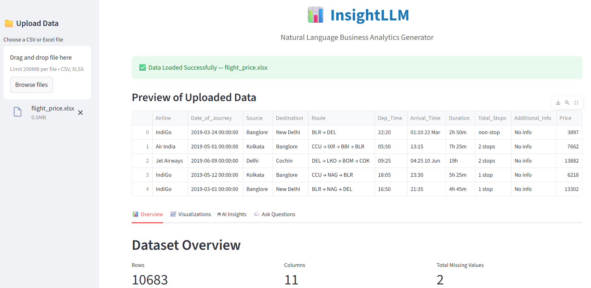

```markdown
# InsightLLM – AI-Powered Business Analytics

InsightLLM is a web application that enables users to upload datasets and instantly get AI-driven insights, visualizations, and answers to natural language questions—no coding required. Powered by Google Gemini and Streamlit, this tool makes data analysis accessible to everyone.

## Features

- **No-Code Analytics:** Upload your data and get instant insights.
- **Natural Language Understanding:** Ask questions about your data in plain English.
- **Interactive Visualizations:** Auto-generated and custom charts for deeper exploration.
- **AI-Powered Insights:** Summarize trends and patterns in simple language.

Here’s the **corrected and clean folder structure** for your `InsightLLM` project — matching your working code setup:

```markdown
## 📂 Folder Structure

```

InsightLLM/
│
├── app.py                        # Main Streamlit application file
│
├── utils/                        # Utility modules (backend logic)
│   ├── **init**.py               # Initializes utils package
│   ├── data_processor.py         # Handles dataset loading, summary stats, and column info
│   ├── llm_handler.py            # Manages AI (Gemini/OpenAI) insights and Q&A
│   ├── visualizer.py             # Generates automatic and custom Plotly charts
│
├── assets/                       # For logos, icons, or UI screenshots
│   └── Insight.png               # Interface image
│
├── .env.example                  # Example environment variable file (for API key)
│
├── requirements.txt              # Dependencies (Streamlit, Pandas, Plotly, etc.)
│
└── README.md                     # Project documentation

```

## Setup

1. Clone the repository.
2. Install dependencies:
   ```bash
   pip install -r requirements.txt
````

3. Create a `.env` file with your Gemini API key:

   ```bash
   GEMINI_API_KEY=your_gemini_api_key_here
   ```
4. Run the app:

   ```bash
   streamlit run app.py
   ```

## Usage

* Upload your dataset (CSV or Excel).
* Explore auto-generated visualizations.
* Use the custom visualization section to create scatter plots.
* Ask questions about your data in the "Ask Questions" tab.

## Screenshots



```
```
