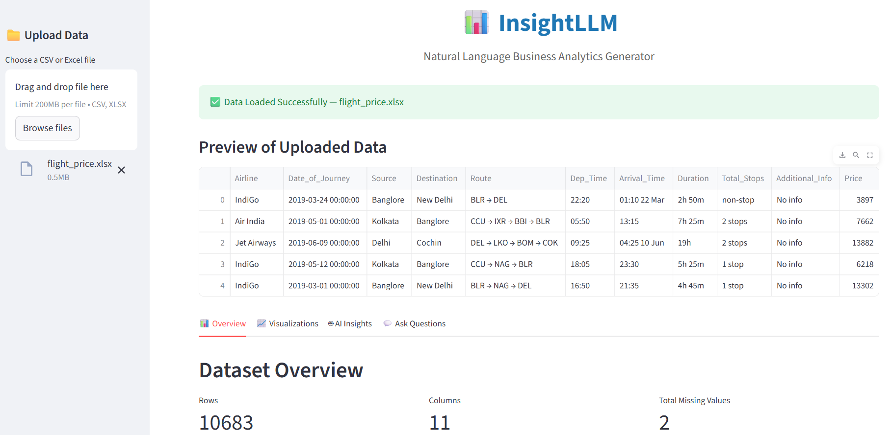

# InsightLLM – AI-Powered Business Analytics

InsightLLM is a web application that enables users to upload datasets and instantly receive AI-driven insights, visualizations, and answers to natural language questions—without writing any code. Powered by Google Gemini and Streamlit, this tool makes data analysis accessible to everyone.

## Features

* **No-Code Analytics:** Upload your data and get instant insights.
* **Natural Language Understanding:** Ask questions about your data in plain English.
* **Interactive Visualizations:** Auto-generated and custom charts for deeper exploration.
* **AI-Powered Insights:** Summarize trends and patterns in simple language.

## Folder Structure

```text
InsightLLM/
│
├── app.py                        # Main Streamlit application
│
├── utils/                        # Utility modules
│   ├── __init__.py               # Marks utils as a Python package
│   ├── data_processor.py         # Dataset loading and preprocessing
│   ├── llm_handler.py            # Gemini API integration
│   └── visualizer.py             # Plotly visualizations
│
├── .env.example                  # Example environment variables
├── requirements.txt              # Project dependencies
├── README.md                     # Project documentation
│
└── assets/
    └── Insight.png               # Application screenshot/logo
```

## Setup

1. Clone the repository:

```bash
git clone <repository-url>
cd InsightLLM
```

2. Install dependencies:

```bash
pip install -r requirements.txt
```

3. Create a `.env` file and add your Gemini API key:

```env
GEMINI_API_KEY=your_gemini_api_key_here
```

4. Run the application:

```bash
streamlit run app.py
```

## Usage

1. Upload a CSV or Excel dataset.
2. Explore automatically generated visualizations and statistics.
3. Create custom visualizations using the chart builder.
4. Ask questions about your data in natural language.
5. Receive AI-generated insights and summaries.

## Screenshots



## Technologies Used

* Python
* Streamlit
* Google Gemini AI
* Pandas
* Plotly
* NumPy

## License

This project is developed for educational and research purposes.
